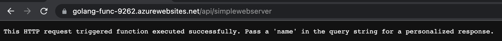
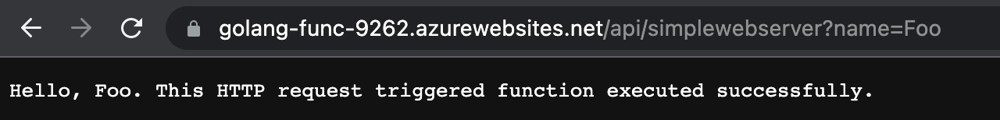

## Azure Functions in Golang

  

Azure docs are [here](https://docs.microsoft.com/en-us/azure/azure-functions/create-first-function-vs-code-other?tabs=go).

This is how I created this repo:

```
func init az-functions-golang --worker-runtime custom
cd az-functions-golang

func new --name simplewebserver --template "HTTP trigger" --authlevel "anonymous"

$ tree simplewebserver
simplewebserver
└── function.json
```

**\# Local function deployment**

```
go build simplewebs.go

$ func start
(...)
	simplewebserver: [GET,POST] http://localhost:7071/api/simplewebserver

$ curl http://localhost:7071/api/simplewebserver
This HTTP request triggered function executed successfully. Pass a 'name' in the query string for a personalized response.

$ curl http://localhost:7071/api/simplewebserver?name=Foo
Hello, Foo. This HTTP request triggered function executed successfully.
```

**\# Azure function deployment**

```
RGNAME=AzureFunctionsGolang-rg &&\
NAME=$RANDOM

az group create --name $RGNAME --location westeurope

az storage account create \
--name sa${NAME}func \
--sku Standard_LRS \
-g $RGNAME


$ az functionapp list-runtimes | grep -i custom -A 3
(...)
  "runtime": "custom",
  "supported_functions_versions": [
    "4",
    "3"

az functionapp create \
--consumption-plan-location westeurope \
--runtime custom --functions-version 4 \
--name golang-func-$NAME \
--os-type linux \
-g $RGNAME \
-s sa${NAME}func

GOOS=linux GOARCH=amd64 go build -o simplewebs simplewebs.go

$ func azure functionapp publish golang-func-$NAME
(...)
Invoke url: https://golang-func-9262.azurewebsites.net/api/simplewebserver

az group delete -n $RGNAME
```




